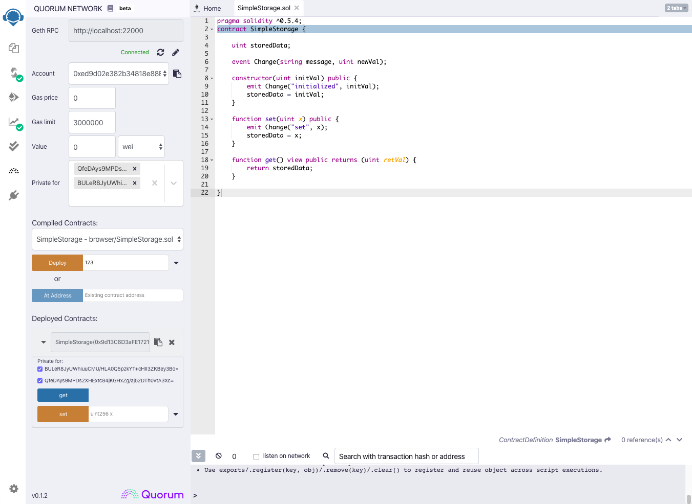

# Quorum Plugin for Remix

<a href="https://bit.ly/quorum-slack" target="_blank" rel="noopener"></a>

The Quorum plugin for Ethereum's Remix IDE adds support for creating and interacting with private contracts on a Quorum network.



## Getting Started

Just go to the [Remix IDE](https://remix.ethereum.org) and activate the **Quorum Network** plugin on the plugins page. For step-by-step instructions, go to the [Getting Started](https://medium.com/remix-ide/quorum-plugin-for-remix-ee232ebca64c) doc.

## Common Issues
**Firefox CORS Issues:**
- Firefox seems to be a little more strict than Chrome at the moment about making cross-origin http requests on https pages. Remix currently loads our plugin in an iframe from an HTTPS url, but our users are frequently running their Quorum node on an HTTP localhost url. The latest Chrome release seems to allow these calls, but Firefox will block them and report a CORS error. We are tracking this issue in #8, but until that is fixed please use Chrome or another browser that doesn't block these requests.

## Contributing
Quorum Plugin for Remix is built on open source and we invite you to contribute enhancements. Upon review you will be required to complete a Contributor License Agreement (CLA) before we are able to merge. If you have any questions about the contribution process, please feel free to send an email to [info@goquorum.com](mailto:info@goquorum.com).

## Development Setup

- Clone the repo and run:

```
yarn install
yarn start
```

- This will start the webpack development server and serve the plugin at http://localhost:3000
- Go to our dev version of [Remix IDE](http://remix-dev.goquorum.com). Make sure you connect to the http version of the site, not https.
- Click on the plugins tab
- Activate the Quorum Network plugin
- The extension should automatically reload with any changes you make.

## Testing
The Quorum plugin uses NightwatchJS to run integration tests on chrome and firefox.

**First you need to make a copy of .env.local.template called .env.local** Then either replace the password placeholder with the rpc password, or uncomment the bottom section to use your local 7nodes instance to run the tests.

Once those environment variables are set up, run one of the following:

```
yarn test_chrome
yarn test_firefox
```

To extend or add new tests, go to the [test-browser/tests](test-browser/tests) folder.

## Building

`yarn build` to run a production build of the plugin. The output is in the build/ directory.
`yarn serve` to serve the build folder from port 3000
